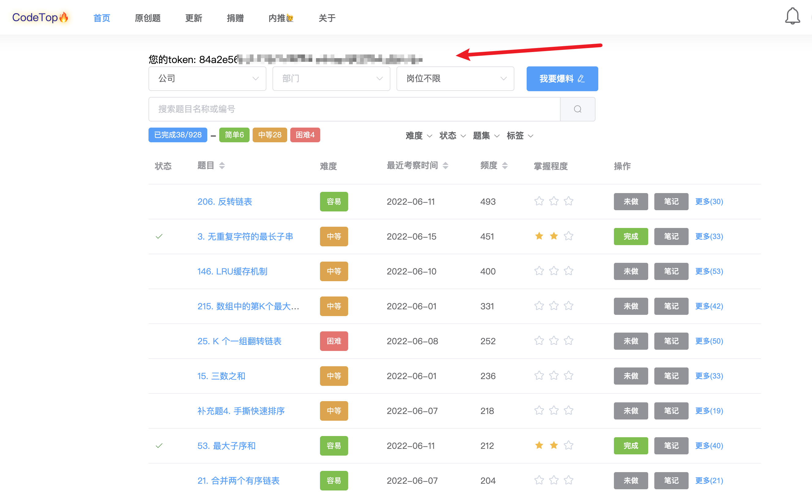
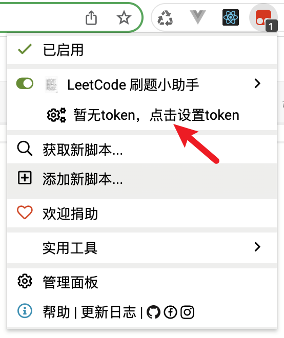
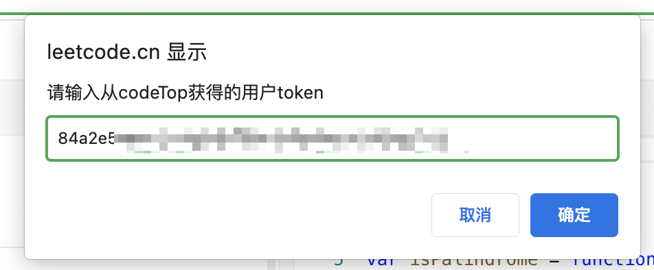
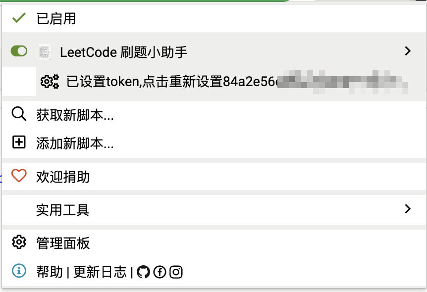
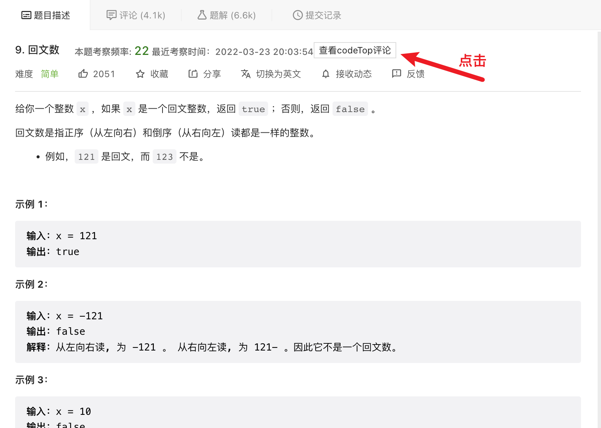
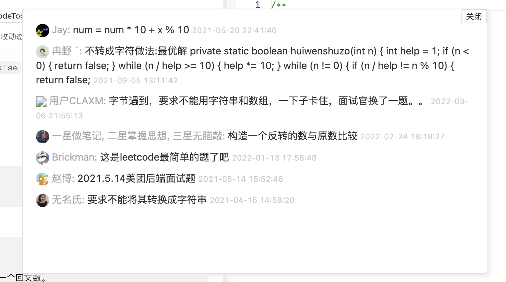

# leetcode-codeTop-assist
在LeetCode刷题界面 快速获得codeTop上的数据进行展示 以供参考
> 本脚本一切数据均来源于codeTop (https://codetop.cc/home)
# 前置条件
这里已经假设您安装好了 **Tampermonkey(油猴脚本浏览器插件)** 并且至少了解如何使用其安装用户脚本。
# 使用说明
## 脚本安装
### 自动安装(推荐)
访问以下url，选择安装脚本

1. https://greasyfork.org/zh-CN/scripts/444881-leetcode-%E5%88%B7%E9%A2%98%E5%B0%8F%E5%8A%A9%E6%89%8B
2. https://greasyfork.org/zh-CN/scripts/446619-codetop-token%E8%8E%B7%E5%8F%96

### 手动安装

1. 首先安装 `code-top-token-getter.js`,新建一个油猴脚本，复制该文件内的内容到Tampermonkey的编辑器中并保存。
2. 之后安装 `leetcode-assist.js` ,新建一个油猴脚本，复制该文件内的内容到Tampermonkey的编辑器中并保存。

## token设置
1. 访问 https://codetop.cc/home 进行登录，登录后刷新页面，可以在页面中看到token显示如下：
2. 复制这个token
3. 随便选择一道LeetCode题目(https://leetcode.cn/problems/palindrome-number/)
4. 点击右上方的Tampermonkey标志 此时还没有token 显示如下：

5. 点击箭头所指的选项，在弹出的窗口中粘贴进我们第2步复制的token:

6. 之后脚本的状态会变成如下所示：
7. 此时刷新LeetCode页面 便可以在题目旁边看到考题频率和codeTop上大伙的评论啦。

## Q&A
1. 为什么我没有 `查看codeTop评论` 这个按钮呢？或者这个按钮总提示找不到元素。
> 可能是因为你的token未配置或者token过期 再重新按照步骤配置一下之后刷新试试
2. 为什么查看的codeTop评论是一片空白？
> ... 那是因为codeTop上对这题也没人评论
3. 为什么我看codeTop上评论很多，但是点击按钮后却就一页？
> 对，数据就请求了一页，所以就1页 更多评论请前往codeTop
4. 为啥有时候会出现结果不对应当前题目的情况？
> 还没做根据url的变化重新请求数据这个功能，预计下个版本优化，现在推荐
1. 从LeetCode题库中选择题目后点击进入
2. 发现此情况后刷新页面